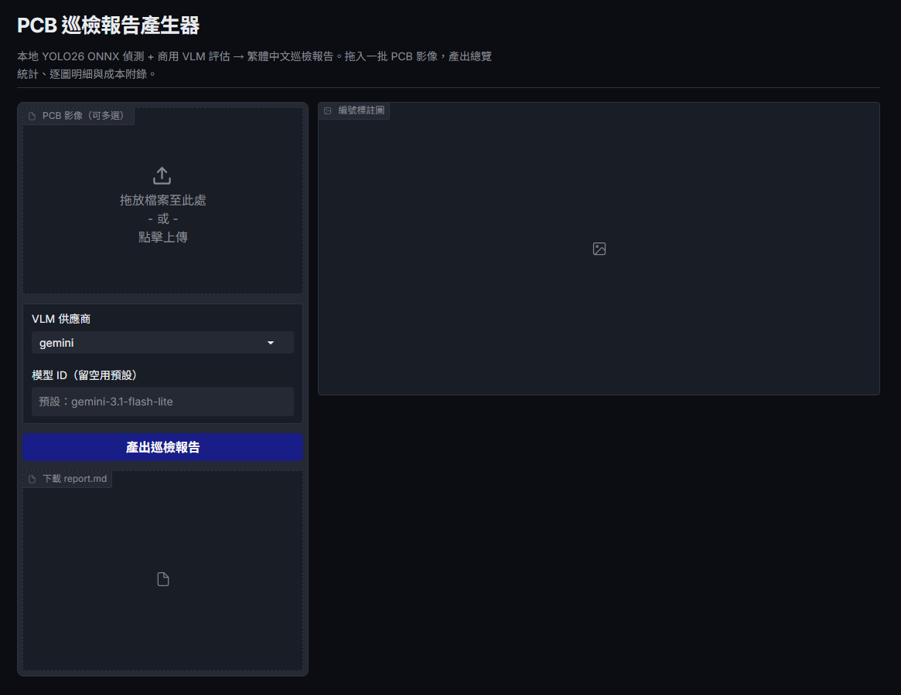
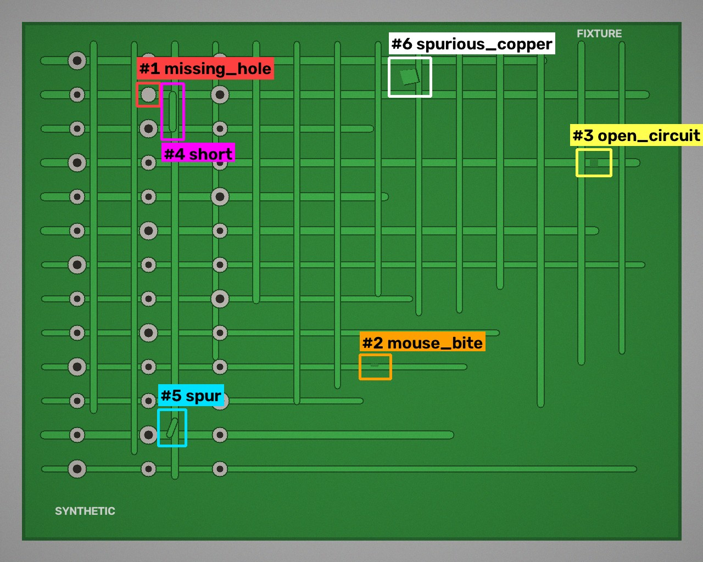
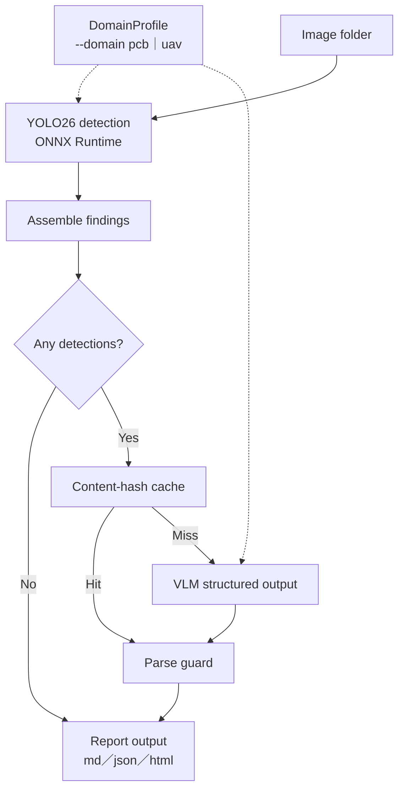

# visual-inspection-reporter

[](https://github.com/kuotunyu/visual-inspection-reporter/actions/workflows/ci.yml)
[](LICENSE)

[繁體中文](README.md)

> Inspection reporting with traceable findings: local YOLO26 ONNX detection + a commercial VLM API → Traditional Chinese inspection reports (PCB and UAV, switchable via `--domain`)



Feed in a batch of images, get `report.md`, `report.json`, and an optional `report.html`:

- **Traceable**: local YOLO26 ONNX produces a numbered overview image, per-finding crops, and a detection JSON first — every VLM judgement must map back to a finding id.
- **Reproducible**: provider abstraction, structured output, content-hash caching, 429/5xx backoff, and RPM limiting all live in one pipeline.
- **Bounded**: Gemini and OpenAI have real synchronous end-to-end runs; Claude and Gemini Batch are explicitly marked Experimental — mock verification is never written up as a live success.



The image above is the actual output of `findings.annotate()` run against a **self-authored synthetic fixture** via `scripts/render_sample_assets.py`, used to demonstrate label placement and numbering layout. The boxes come from ground truth recorded by the synthesis script itself — **they are not model predictions** (see the domain-shift note under Limitations for why). This repo does not distribute any dataset imagery; see Dataset & Licensing below.

## Completion status and verification boundary

| Scope | Status | Verification |
|---|---|---|
| Local YOLO detection, findings assembly, reports (MD/JSON/HTML), caching/retry/cost, Gradio | **Core complete** | Offline pytest + local smoke run / sample output |
| Gemini / OpenAI synchronous providers | **Core complete** | Real successful API responses + offline schema/error-handling tests |
| Claude provider | **Experimental** | SDK request shape and offline mock tests complete; test-account credit was insufficient, so there is no successful live end-to-end run yet |
| Gemini Batch API | **Experimental** | SDK types, metadata correlation, and polling/partial-failure handling all have offline mock tests; a live job has not yet been successfully submitted on an available account |

The default synchronous flow is therefore reproducible as the v1 core deliverable; `--provider claude` and `--batch-api` remain optional experimental features and are not part of the core-complete claim.

## Why "a small self-trained model for detection, a commercial API model for understanding and writing"?

| | Self-trained YOLO26n (local ONNX) | Commercial VLM API |
|---|---|---|
| Good at | Fixed-class localization and recall, millisecond inference, zero API cost | Open-ended visual understanding, false-positive identification, professional writing |
| Not good at | Explaining "why this is a problem and what to do about it" | Precisely localizing small objects; scanning full images one by one is slow and expensive |
| Measured | CPU p50 ≈ 81 ms/image (upstream benchmark) | flash-lite tier ≈ $0.0027/image (measured in this repo) |

The two-stage split lets the VLM look only at the small number of pixels that have already been cropped and numbered, so tokens go where they matter: detection answers "where is what," the VLM answers "how severe, why, and what to do." The VLM can also catch the detector's own false positives — in testing it correctly identified every `missing_hole` false positive that was actually silkscreen text, and flagged each one as "false positive, recommend manual confirmation."

## Architecture



Details are below under "Engineering details" — the diagram only shows the main flow, to avoid GitHub shrinking an over-crowded diagram into something unreadable.

Engineering details:

- **Provider abstraction**: a `VLMProvider` interface + factory, with `--provider gemini|openai|claude` sharing one call interface. Gemini uses `google-genai`'s `response_schema`; OpenAI uses the Responses API's `responses.parse`; Claude uses the Messages API's `messages.parse(output_format=...)`. The first two have successful live end-to-end runs; Claude is currently Experimental.
- **Structured output + guardrails**: the Pydantic schema goes straight to the API; any returned `finding_id` must be a subset of the detection JSON's ids — hallucinated ids are dropped, unassessed ids are labeled "not evaluated" in the report, and nothing is fabricated.
- **Caching**: key = sha256(source image bytes + detection JSON + model + prompt version + schema version). Re-running the same batch costs $0; changing the prompt auto-invalidates the cache.
- **Resilience**: exponential backoff on 429/5xx/timeout (up to 5 attempts), waiting the larger of "the provider's suggested delay" and "exponential backoff" — most SDKs use the HTTP `Retry-After` header, but google-genai's 429 puts the suggested delay in the JSON body's `google.rpc.RetryInfo` (no header) — both are parsed, a fix added after hitting it in testing — plus a sliding-window RPM limiter (default 8, matched to the Gemini free tier; `--max-rpm 0` disables it). A single image failing is recorded against that image only, not the whole batch.
- **Gemini Batch API (Experimental)** (`--batch-api`, Gemini only): checks the cache first, then submits everything left as one batch job and polls until done. Uses `InlinedRequest`/`InlinedResponse`'s `metadata` field to correlate results back to the original request rather than relying on response order; orchestration and failure isolation have offline tests, but a successful job on a real account has not yet been verified.
- **Cost accounting**: token counts come from the API's actual reported usage, converted to USD using official pricing (synchronous, or 50% off for Batch) and appended to the end of the report.

## Sample report excerpt

Excerpted from [assets/sample_report.md](assets/sample_report.md) (actual output for 5 sample images):

> ### 4. 04_short_01.jpg — Verdict: Fail
>
> | # | Class | Confidence | Severity | Description | Recommended action |
> |---|---|---|---|---|---|
> | #1 | Short | 0.66 | Critical | A clear copper bridge appears between traces, causing a short circuit that seriously affects electrical function. | Judged as failing; scrap or rework evaluation needed. |
> | #2 | Missing hole | 0.53 | Minor | On close inspection of the zoomed-in crop, this area is silkscreen text, not a drilled hole — the model misclassified it. | This is a false positive; no action needed. |
>
> **Overall assessment**: This board has multiple serious defects, including a short and an open circuit, directly affecting circuit function; judged as failing.

## Measured cost (2026-07-09, exchange rate 32.1)

Converted from this repo's measured usage (token counts are API-reported values; unit prices are official paid-tier pricing; actual billing on a free tier is $0). **These are estimates verified on a specific date, not a live pricing promise** — the converted unit prices go stale as providers adjust pricing, so check the current official pricing page yourself before re-running this:

| Model | Measured basis | Approx. per image | Approx. per 100 images |
|---|---|---|---|
| `gemini-3.1-flash-lite` (default) | 5-image batch: 40,604 in / 2,305 out tokens, $0.0136 | $0.0027 | **$0.27 ≈ NT$8.7** |
| `gpt-5.4-nano` (--provider openai) | 1 image: 3,871 in / 676 out, $0.0016 | $0.0016 | $0.16 ≈ NT$5.2 |
| `gemini-3.5-flash` (upgrade re-check) | 1 image: 8,819 in / 2,898 out, $0.0393 | $0.0393 | $3.93 ≈ NT$126 |

Model recommendation: flash-lite tier is sufficient for routine inspection. Testing found the lite tier can misclassify **subtle low-contrast defects** (e.g. thin residual-copper traces) as false positives; on the same image, `gemini-3.5-flash` correctly identified three residual-copper spots and read the silkscreen text — for important batches, re-check with `--model gemini-3.5-flash` (roughly 15x the cost).

## Cross-domain portability: `--domain uav`

The same pipeline (detect → assemble findings → VLM structured output → report) can serve a completely different task just by swapping in a different `DomainProfile` (weights + class table + prompt + report vocabulary) — not one line of `detector`/`pipeline`/`report` code needs to change. Tested by swapping in the YOLO26s VisDrone weights (10 classes: pedestrian/crowd/bicycle/car/van/truck/tricycle/awning-tricycle/bus/motorcycle) from another portfolio project, [uav-traffic-vision](https://huggingface.co/steven0226/uav-traffic-vision), producing a "UAV aerial patrol report" instead of a "PCB inspection report":

```bash
uv run python inspect_cli.py --input-dir my_drone_photos --output output_uav/ --domain uav
```

Tested on one densely-packed intersection aerial image with 182 objects: `gemini-3.1-flash-lite` assessed the entire scene in a single API call, and the overall summary correctly captured the situational judgement of "heavy but orderly intersection traffic, no immediate safety risk." The PCB domain's "severity/verdict" semantics (defect severity, pass/fail) kept working correctly once the prompt was swapped to patrol semantics (risk level, whether to report) — this is the verification that "a domain profile only swaps data and wording; the engineering skeleton doesn't move."

Adding a new domain only requires adding one `DomainProfile` in `src/inspector/domains.py` (weights path, class table, prompt, report vocabulary, known limitations) — no need to touch `detector.py`/`pipeline.py`/`report.py`. **The VisDrone dataset is for academic research use only**; this repo does not ship any UAV imagery, so you'll need your own test images. UAV weights are likewise not distributed with the repo and must be downloaded separately into `weights/`:

```bash
hf download steven0226/uav-traffic-vision yolo26s_visdrone_640.onnx --local-dir weights
```

## More output formats

```bash
uv run python inspect_cli.py --input-dir sample_images --output output/ --html
```

This additionally produces a `report.html`, reusing the same dark-theme color tokens as the Gradio interface — handy for emailing directly or opening in a browser without a Markdown viewer.

## Quick start

Requirements: [uv](https://docs.astral.sh/uv/), and a repo-root `.env` (`GEMINI_API_KEY=...`, or `GOOGLE_API_KEY=...` also works — `google-genai` accepts either, preferring `GOOGLE_API_KEY`; add `OPENAI_API_KEY`/`ANTHROPIC_API_KEY` if using those providers — neither is required if you're only using the default Gemini provider).

```bash
git clone https://github.com/kuotunyu/visual-inspection-reporter.git
cd visual-inspection-reporter
uv sync

# Create your local env file, then fill in only the provider keys you'll actually use
cp .env.example .env
# On Windows PowerShell: Copy-Item .env.example .env

# Weights (not distributed with the repo): download best.onnx from Hugging Face into weights/
hf download steven0226/pcb-defect-detection best.onnx --local-dir weights

# Test images: if you'd rather not download a dataset first, generate a batch of
# self-authored synthetic boards instead (clearly licensed, zero downloads)
uv run python scripts/make_synthetic_pcb.py --output-dir sample_images

# CLI: batch inspection
uv run python inspect_cli.py --input-dir sample_images --output output/
uv run python inspect_cli.py --input-dir ... --provider openai          # switch core provider (gemini｜openai)
uv run python inspect_cli.py --input-dir ... --provider claude          # Experimental; needs a separate live E2E
uv run python inspect_cli.py --input-dir ... --model gemini-3.5-flash   # switch model
uv run python inspect_cli.py --input-dir ... --detect-only              # detection only
uv run python inspect_cli.py --input-dir ... --domain uav               # switch domain (see "Cross-domain portability" above)
uv run python inspect_cli.py --input-dir ... --batch-api                # Experimental; not real-time, see Limitations for account requirements
uv run python inspect_cli.py --input-dir ... --html                     # also produce report.html

# Gradio UI (http://localhost:7860; provider is switchable, but --domain/--batch-api are CLI-only for now)
uv run python app.py

# Tests (mock VLM, zero network)
uv run pytest
```

Main flags: `--conf` detection confidence threshold (defaults per `--domain`), `--max-workers` concurrency (4), `--max-rpm` rate limit (8, `0` disables it), `--no-cache` disables the response cache.

Test images come from two sources:

- **Synthetic fixtures (default, zero downloads)**: `scripts/make_synthetic_pcb.py` synthesizes board layouts and all six defect classes from scratch using geometric drawing, with a ground-truth manifest attached, licensed the same as this repo. Good for validating the full pipeline, report format, and provider integration.
- **Real PCB images (for measuring detection quality)**: the original HRIPCB dataset is not distributed with the repo; you can download it yourself from [Kaggle akhatova/pcb-defects](https://www.kaggle.com/datasets/akhatova/pcb-defects) and drop a few images into `sample_images/`. The detection weights were trained on these real photos, so only real images reflect actual detection performance.

## Project structure

```
inspect_cli.py / app.py          # CLI and Gradio entry points
scripts/                         # synthetic fixture generator, README asset regeneration scripts
src/inspector/
├── config.py                    # cross-domain shared pricing table (with verification date), thresholds, version numbers
├── domains.py                   # DomainProfile: weights/classes/prompt/report vocabulary for pcb｜uav
├── detector.py                  # ONNX Runtime inference (YOLO26 e2e, NMS-free; class_names supplied by the caller)
├── findings.py                  # numbered annotation image (label avoidance/boundary clamping), context crop, detection JSON
├── schema.py / prompt.py        # Pydantic output schema, per-domain Traditional Chinese inspection instructions
├── providers/                   # gemini.py, openai_provider.py, claude.py, base.py (abstraction layer)
├── batch_gemini.py              # Gemini Batch API: submit/poll/retrieve (metadata correlates results to original requests)
├── cache.py / cost.py / retry.py# caching, cost accounting (sync/Batch pricing), backoff retry + RPM limiting
├── pipeline.py                  # batch flow (concurrent or Batch API, per-image error isolation)
└── report.py                    # report.md / report.json / report.html rendering
tests/                           # offline pytest (including provider/Batch mocks — zero network, zero API cost)
```

## Limitations

- Under the most honest board-grouped split, the detection model measures only 0.565 AP50 for the `short` class and 0.793 for `spurious_copper` (see the [upstream project](https://huggingface.co/steven0226/pcb-defect-detection)) — defects the detector misses, the VLM never sees. For UAV, `awning-tricycle` (AP50-95 0.107) and `bicycle` (0.124) are the weakest classes, and very small objects score low across the board (see [uav-traffic-vision](https://huggingface.co/steven0226/uav-traffic-vision)).
- The flash-lite tier VLM has real limits on subtle, low-contrast defects (see the residual-copper case in the cost section).
- **Synthetic fixtures validate the pipeline only — they do not measure detection quality**: the detection weights were trained on real HRIPCB photos and show clear domain shift on synthetic boards — in testing, every normal solder pad on a synthetic board was misclassified as `missing_hole` (34 false positives per image, confidence up to 0.83, and raising the threshold does not filter them out). So the synthetic images `scripts/` produces are used to exercise the pipeline, reports, and provider integration; detection accuracy claims always come from the upstream [pcb-defect-detection](https://huggingface.co/steven0226/pcb-defect-detection) numbers on the real test set.
- Gemini quota varies by account, project, and plan; this repo actually hit 429s during development (including on Batch submission), which is why `--max-rpm` and the Google-specific RetryInfo backoff exist. Adjust for your own quota before large batches — this README does not guarantee a fixed RPM.
- The Claude provider has verified that SDK requests reach the API, with mocks covering multimodal payloads, structured results, usage, and parse failures; due to insufficient credit on the test account at the time, **there is no successful live response yet**, so it is marked **Experimental**.
- The Gemini Batch API has been validated against the actually-installed SDK's types, with mocks covering job submission, polling, metadata correlation, partial failures, and missing responses; the available test key returned 429 or 400 `FAILED_PRECONDITION`, and account/project conditions at the time were insufficient, so **a successful live job has not yet been obtained**, and it is marked **Experimental**. Before claiming production-readiness, a cost-bounded end-to-end run on an account with Batch access is still needed.

## Dataset and licensing

- The detection weights and inference code are derived from the upstream project [pcb-defect-detection](https://huggingface.co/steven0226/pcb-defect-detection) (trained with ultralytics YOLO26).
- **This repo does not distribute any dataset imagery or derivatives of it.** Exactly two image files ship with the repo, both self-authored and licensed the same as the repo:
  - `assets/sample_annotated.jpg`: a board synthesized by `scripts/make_synthetic_pcb.py`, annotated by `scripts/render_sample_assets.py` — reproducible via `uv run python scripts/render_sample_assets.py`.
  - `assets/ui_workstation.png`: a local screenshot of `uv run python app.py` running.
- Dataset: HRIPCB (PKU-Market-PCB), sourced from [Kaggle akhatova/pcb-defects](https://www.kaggle.com/datasets/akhatova/pcb-defects), **license marked Unknown**, citing [Huang & Wei (2019)](https://arxiv.org/abs/1901.08204). Because the license is unclear, the original data, `sample_images/`, and any display imagery derived from it are never checked into the repo — obtain real images yourself and take on the licensing responsibility for them.
- `assets/sample_report.md` is this tool's actual text output for 5 HRIPCB images (report text and token usage only, no imagery) — the numbers in the README's cost table come from that run.
- **VisDrone (`--domain uav`) is for academic research use only**; this repo likewise does not ship any UAV imagery.
- License: **AGPL-3.0-or-later** (inherited from ultralytics' license copyleft terms).
