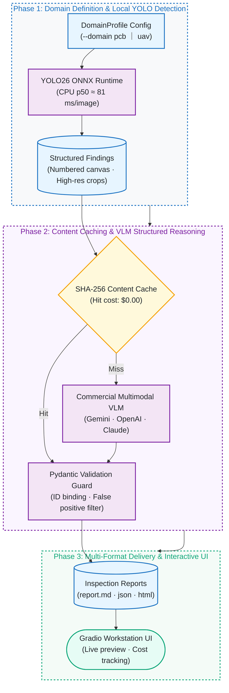

# visual-inspection-reporter: Industrial Visual Inspection with YOLO26 & Multimodal VLM

[](https://github.com/kuotunyu/visual-inspection-reporter/actions/workflows/ci.yml)


[](LICENSE)

[繁體中文](README.md)

An industrial dual-stage inspection reporting pipeline combining lightweight local YOLO26 ONNX detection with commercial multimodal Vision-Language Models (Gemini 3.1 Flash-Lite / OpenAI GPT-5.4 Nano / Claude): local detection handles fast, high-recall localization and numbered crops, while the VLM evaluates severity, diagnoses root causes, suggests remediation, and filters false positives into Markdown, JSON, and standalone HTML reports.


---

## System Architecture & Pipeline

### 1. Dual-Stage Inspection & Report Generation Pipeline



### 2. System Resilience & Architectural Guardrails

```mermaid
%%{init: {'themeVariables': {'fontSize': '18px'}}}%%
flowchart TD
    subgraph AdapterStage ["Phase 1: Multimodal Provider Abstraction"]
        direction LR
        P1[("Google Gemini<br/>(google-genai structured output)")]
        P2[("OpenAI API<br/>(Responses API parse)")]
        P3[("Anthropic Claude<br/>(Messages API parse)")]
    end

    subgraph GuardStage ["Phase 2: Resilience & Cost Guardrails"]
        direction LR
        Retry["Exponential Backoff<br/>(Parses google.rpc.RetryInfo)"] --> RPM["Sliding-Window RPM Limiter<br/>(Matches free/paid tier quotas)"] --> Cost["Real-Time Token Accounting<br/>(Official API pricing tables)")]
    end

    subgraph ExtensionStage ["Phase 3: Domain Extension & Verification"]
        direction LR
        Profiles[("DomainProfile Injection<br/>(PCB defect ➔ UAV traffic patrol)")] --> CLI["inspect_cli.py Batch Engine<br/>(Resume-safe · Fault isolated)"] --> Tests{"Offline Mock Test Suite<br/>(44 unit tests passing)"}
    end

    P1 & P2 & P3 --> Retry
    Cost --> Profiles

    classDef srcStyle fill:#e7f5ff,stroke:#1971c2,stroke-width:2px,color:#212529
    classDef procStyle fill:#f3e5f5,stroke:#7b1fa2,stroke-width:2px,color:#212529
    classDef condStyle fill:#fff9db,stroke:#f59f00,stroke-width:2px,color:#212529

    class P1,P2,P3,Profiles srcStyle
    class Retry,RPM,Cost,CLI procStyle
    class Tests condStyle

    style AdapterStage fill:#f8f9fa,stroke:#1971c2,stroke-width:2px,color:#1971c2,stroke-dasharray: 4 4
    style GuardStage fill:#faf5ff,stroke:#7b1fa2,stroke-width:2px,color:#7b1fa2,stroke-dasharray: 4 4
    style ExtensionStage fill:#f4fbf7,stroke:#0ca678,stroke-width:2px,color:#0ca678,stroke-dasharray: 4 4
```

---

## Core Architecture: Local Specialized Detection + Cloud Generalist Reasoning

| Dimension | Specialized YOLO26n (Local ONNX) | Commercial Multimodal VLM API |
|---|---|---|
| Strengths | Fast, fixed-category localization & high recall; sub-100ms, zero API cost | Open-domain visual understanding, root-cause reasoning, false positive rejection, narrative synthesis |
| Limitations | Cannot explain defect implications, root causes, or suggest disposition | Scanning whole high-res images directly is slow and expensive |
| Measured Performance | CPU p50 ≈ 81 ms/image | Flash-Lite tier ≈ $0.0027/image |

**Engineering Synergy:** The dual-stage pipeline ensures the VLM receives only numbered, tightly cropped regions of interest, maximizing token efficiency. The VLM also serves as a secondary verification filter: in empirical testing, it reliably identified silkscreen markings misclassified as `missing_hole` and marked them as "False positive, no action required."


---

## Scope & Verification Boundaries

| Module | Status | Verification Level |
|---|---|---|
| Local YOLO detection, findings builder, multi-format reports (MD/JSON/HTML), cache/retry/cost, Gradio UI | Core Complete | Full offline pytest coverage + local end-to-end runs |
| Google Gemini / OpenAI Sync Provider | Core Complete | Live API verification + offline schema/error handling tests |
| Anthropic Claude Provider | Experimental | Request schema & offline mocks verified; awaiting live quota verification |
| Gemini Batch API (`--batch-api`) | Experimental | Schema, metadata correlation, and asynchronous polling verified via offline mocks |

---

## Sample Report Excerpt

From [assets/sample_report.md](assets/sample_report.md) (actual run on 5 sample images):

> ### 4. 04_short_01.jpg — Disposition: REJECT
>
> | # | Category | Confidence | Severity | Description | Recommended Action |
> |---|---|---|---|---|---|
> | #1 | Short circuit (short) | 0.66 | Critical | Noticeable copper bridging between traces causing an electrical short. | Reject board; evaluate for rework or scrapping. |
> | #2 | Missing hole (missing_hole) | 0.53 | Low | Inspection of high-res crop indicates silkscreen text, not a drilled hole. | False positive detection; no action required. |
>
> **Summary Assessment**: Multiple critical defects detected including shorts and opens directly impacting electrical integrity. Disposition: REJECT.

---

## Cost Benchmarks & Model Selection

Empirical token costs based on 2026-07 pricing (free tiers incur $0.00):

| Model | Measurement Basis | Est. Cost / Image | Est. Cost / 100 Images |
|---|---|---|---|
| `gemini-3.1-flash-lite` (Default) | 5-image batch: 40,604 in / 2,305 out tokens | $0.0027 | **$0.27 ≈ NT$8.7** |
| `gpt-5.4-nano` (`--provider openai`) | 1 image: 3,871 in / 676 out tokens | $0.0016 | $0.16 ≈ NT$5.2 |
| `gemini-3.5-flash` (Deep review) | 1 image: 8,819 in / 2,898 out tokens | $0.0393 | $3.93 ≈ NT$126 |

---

## Domain Portability: `--domain uav`

The pipeline is completely decoupled from domain logic. Changing the `DomainProfile` adapts the inspection engine from PCB manufacturing to UAV aerial patrol:

```bash
uv run python inspect_cli.py --input-dir my_drone_photos --output output_uav/ --domain uav
```

In empirical testing on a dense aerial intersection (182 detected objects), the VLM seamlessly adapted defect severity semantics into traffic risk assessment within a single API call.

---

## Quick Start

### Requirements
- Python 3.12+ and [uv](https://docs.astral.sh/uv/).
- Configure `.env` with provider API keys (`GEMINI_API_KEY`, `GOOGLE_API_KEY`, `OPENAI_API_KEY`, or `ANTHROPIC_API_KEY`).

```bash
# 1. Install dependencies
uv sync

# 2. Configure environment
cp .env.example .env

# 3. Download YOLO26 weights to weights/
hf download steven0226/pcb-defect-detection best.onnx --local-dir weights

# 4. Generate synthetic test fixtures (zero download, fully reproducible)
uv run python scripts/make_synthetic_pcb.py --output-dir sample_images

# 5. Run batch inspection CLI
uv run python inspect_cli.py --input-dir sample_images --output output/ --html

# 6. Launch Gradio workstation console
uv run python app.py

# 7. Run test suite (offline mocks, 0 external network requests)
uv run pytest
```

---

## Data and Licensing

- Code: [GNU Affero General Public License v3.0 (AGPL-3.0)](LICENSE).
- Synthetic fixture generator outputs share the repository license; third-party datasets follow upstream terms.
