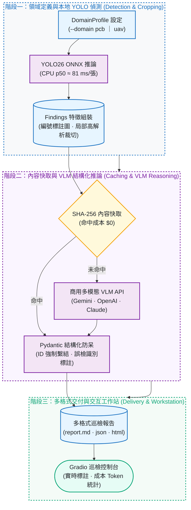
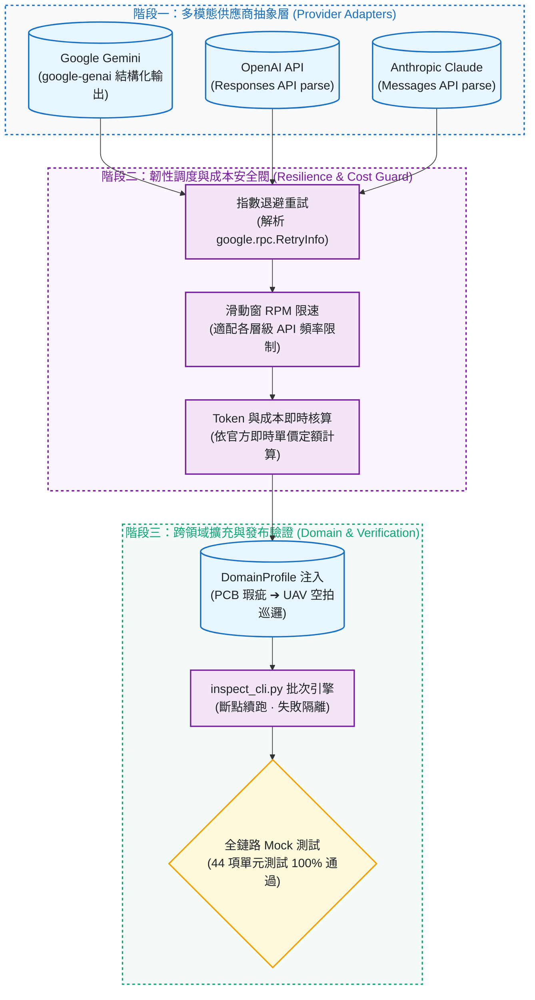

# visual-inspection-reporter：YOLO26 與多模態 VLM 智慧巡檢報告產生器

[](https://github.com/kuotunyu/visual-inspection-reporter/actions/workflows/ci.yml)


[](LICENSE)

[English](README.en.md)

本專案為結合自訓輕量化 YOLO26 ONNX 物件偵測與商用多模態 VLM API（Gemini 3.1 Flash-Lite / OpenAI GPT-5.4 Nano / Claude）的工業級雙階段智慧巡檢報告產生器：本地偵測負責高召回定位與局部裁切標號，雲端 VLM 負責瑕疵嚴重度判定、根因解析、處置建議與誤檢過濾，自動輸出 Markdown、JSON 與獨立 HTML 巡檢報告。


---

## 系統架構與 Pipeline

### 1. 雙階段視覺巡檢與報告生成 Pipeline



### 2. 系統架構與韌性防護防線



---

## 核心設計：自訓小模型定位 ＋ 商用大模型理解

| 維度 | 自訓 YOLO26n（本地 ONNX Runtime） | 商用多模態 VLM API |
|---|---|---|
| 核心優勢 | 固定類別高速定位與高召回，毫秒級推論、零 API 成本 | 開放式視覺語意理解、根因診斷、誤檢識別、專業建議生成 |
| 潛在短板 | 無法判讀「瑕疵成因、處置決策與文字說明」 | 精細小目標定位耗時昂貴，逐張全圖直接掃描成本極高 |
| 實測效能 | CPU p50 ≈ 81 ms/張（上游基準） | Flash-Lite 級 ≈ $0.0027/張（本專案實測） |

**工程綜效：** 雙階段架構讓 VLM 僅需處理裁切標號後的特徵像素，Token 效率最佳化。同時 VLM 具備雙重驗證能力——實測中成功識破絲印文字被誤判為 `missing_hole` 的情況，並在報告中主動標註「誤檢，無需處理」。


---

## 完成度與驗證邊界

| 功能模組 | 交付狀態 | 驗證等級 |
|---|---|---|
| 本地 YOLO 偵測、Findings 組裝、多格式報告（MD/JSON/HTML）、快取/重試/成本、Gradio 工作站 | 核心完成 | 離線 pytest 完整覆蓋 + 本機端到端實測驗證 |
| Google Gemini / OpenAI 同步 Provider | 核心完成 | 真實 API 呼叫驗收通過 + 離線 Schema/例外處理測試 |
| Anthropic Claude Provider | 實驗性質 | SDK 請求建構與離線 Mock 測試通過；受限帳戶額度，尚無 Live E2E |
| Gemini Batch API（`--batch-api`） | 實驗性質 | SDK 型別、Metadata 關聯鍵與非同步輪詢通過離線 Mock 測試 |

---

## 範例報告節錄

節錄自 [assets/sample_report.md](assets/sample_report.md)（5 張樣本圖實際輸出）：

> ### 4. 04_short_01.jpg — 判定：不合格
>
> | # | 類別 | 信心度 | 嚴重度 | 瑕疵說明 | 建議處置措施 |
> |---|---|---|---|---|---|
> | #1 | 短路（short） | 0.66 | 重大 | 走線間出現明顯銅橋接造成短路，嚴重影響電氣功能。 | 判定為不合格，需進行報廢或返修評估。 |
> | #2 | 缺孔（missing_hole） | 0.53 | 輕微 | 經檢視局部放大圖，該區域為絲印文字而非鑽孔，模型誤判。 | 此項為誤檢，無需處理。 |
>
> **總評**：本板存在多項嚴重瑕疵，包含短路與斷路，直接影響電路功能，判定為不合格。

---

## 成本實測與模型選型

基於 2026-07 實測 Token Usage 換算（官方付費層定價；免費額度實際支出 $0）：

| 模型 | 實測基礎 | 單張成本約 | 每 100 張成本約 |
|---|---|---|---|
| `gemini-3.1-flash-lite`（預設建議） | 5 張批次：40,604 in / 2,305 out tokens | $0.0027 | **$0.27 ≈ NT$8.7** |
| `gpt-5.4-nano`（--provider openai） | 1 張單測：3,871 in / 676 out tokens | $0.0016 | $0.16 ≈ NT$5.2 |
| `gemini-3.5-flash`（高精度複核） | 1 張單測：8,819 in / 2,898 out tokens | $0.0393 | $3.93 ≈ NT$126 |

- **日常巡檢：** 推薦使用 `flash-lite` 級別，高性價比且速度快。
- **高階複核：** 若遇到細微低對比殘銅等極限瑕疵，可啟用 `--model gemini-3.5-flash` 進行深度文字與細節判讀。

---

## 跨領域可移植性：`--domain uav`

本專案 pipeline 完全解耦領域邏輯。透過更換 `DomainProfile`（權重 + 類別定義 + Prompt + 專用詞彙），即可無縫切換至無人機空拍巡檢任務：

```bash
uv run python inspect_cli.py --input-dir my_drone_photos --output output_uav/ --domain uav
```

在 182 個物件的密集空拍路口實測中，VLM 能正確將瑕疵嚴重度語意轉化為交通風險關注度，並在單次 API 呼叫中完成全場景巡邏綜合評估。

---

## 快速開始

### 環境需求
- Python 3.12+ 與 [uv](https://docs.astral.sh/uv/) 套件管理工具。
- 設定 `.env` 填入 API 金鑰（`GEMINI_API_KEY` 或 `GOOGLE_API_KEY`；若使用其他供應商則填入 `OPENAI_API_KEY` 或 `ANTHROPIC_API_KEY`）。

```bash
# 1. 安裝環境依賴
uv sync

# 2. 建立環境變數設定檔
cp .env.example .env

# 3. 下載預訓練權重至 weights/ 目錄
hf download steven0226/pcb-defect-detection best.onnx --local-dir weights

# 4. 生成自製合成測試影像（零外部下載、授權明確）
uv run python scripts/make_synthetic_pcb.py --output-dir sample_images

# 5. 執行批次巡檢 CLI
uv run python inspect_cli.py --input-dir sample_images --output output/ --html

# 6. 啟動 Gradio 互動式巡檢工作站
uv run python app.py

# 7. 執行單元測試套件（Mock VLM，零外部網路連線）
uv run pytest
```

---

## 專案結構

```text
src/inspector/
├── detector.py      # ONNX Runtime YOLO26 偵測封裝與預處理
├── findings.py      # Bounding box 裁切、自適應標籤排版與資料結構
├── providers/       # VLMProvider 抽象介面 (Gemini / OpenAI / Claude)
├── pipeline.py      # 雙階段巡檢調度、SHA-256 快取與指數退避重試
├── domains.py       # DomainProfile 跨領域定義 (PCB / UAV)
├── report.py        # Markdown / JSON / HTML 報告生成引擎
└── cost.py          # Token Usage 追蹤與官方定價換算
app.py               # Gradio 巡檢工作站 UI
inspect_cli.py       # 命令列批次巡檢工具
scripts/             # 測試樣本生成與輔助腳本
tests/               # 44 項單元測試與 Mock 驗證套件
```

---

## 資料與授權

- 程式碼採用 [GNU Affero General Public License v3.0 (AGPL-3.0)](LICENSE) 授權。
- 合成資料生成腳本輸出與本專案同授權；真實資料集請遵循上游規範。
